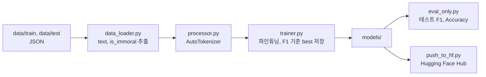

# 문장 윤리성 분류 모델

비윤리적인 문장을 탐지하기 위해 BERT 계열 사전 학습 모델을 파인튜닝하는 파이프라인이다. Hugging Face `transformers`, `datasets`와 PyTorch로 데이터 로드, 전처리, 학습, 평가, 모델 저장, Hugging Face Hub 업로드까지 수행한다.

## 구조



## 결과

| 모델 | 테스트 F1 |
|---|---:|
| beomi/kcbert-base (최고) | 0.8747 |

`src/main.py`의 `MODEL_NAME`을 바꿔 여러 모델을 같은 파이프라인으로 실험했다.

## 내 역할

1인 프로젝트다. 데이터 로더, 토크나이징, 학습 루프, 평가 스크립트, Hub 업로드를 모두 구현했다.

## 구조와 설계 결정

학습 루프(`src/trainer.py`)는 검증 F1이 최고값을 넘을 때만 모델을 저장한다. 라벨이 `Clean(0)`/`Immoral(1)` 둘이라 F1은 binary 평균을 쓴다. 옵티마이저는 AdamW(lr 2e-5), 기본 3 epoch, 배치 32다.

모델 로드(`src/model.py`)는 `AutoModelForSequenceClassification`을 쓴다. `MODEL_NAME` 하나만 바꾸면 KcBERT, RoBERTa 등으로 교체되고, 업로드 저장소 이름은 `프로젝트명-모델명` 규칙으로 자동 생성된다.

데이터 로더(`src/data_loader.py`)는 중첩된 JSON에서 `text`와 `is_immoral`만 뽑아 DataFrame으로 만든다. 학습 데이터 형식은 아래와 같다.

```json
[
  {
    "sentences": [
      {"text": "이 문장은 예시입니다.", "is_immoral": false, "types": []},
      {"text": "비윤리적인 문장 예시...", "is_immoral": true, "types": ["CENSURE", "HATRED"]}
    ]
  }
]
```

## 기술 스택

Python, PyTorch, transformers, datasets, huggingface_hub, scikit-learn, pandas

## 실행 방법

```bash
pip install torch transformers datasets huggingface_hub python-dotenv pandas scikit-learn tqdm
```

Hub 업로드를 위해 프로젝트 루트에 `.env`를 만든다. 이 파일은 커밋하지 않는다.

```ini
HF_TOKEN=hf_여기에_발급받은_토큰_입력
HF_USERNAME=본인_허깅페이스_아이디
```

```bash
python src/main.py            # 학습, 평가, 업로드
python scripts/eval_only.py   # 저장된 모델의 테스트 F1, Accuracy
python scripts/push_to_hf.py  # 수동 업로드
```

에폭과 배치 크기는 `src/main.py`의 `train_model` 호출에서 바꾼다. 메모리가 부족하면 배치를 16이나 8로 줄인다.
